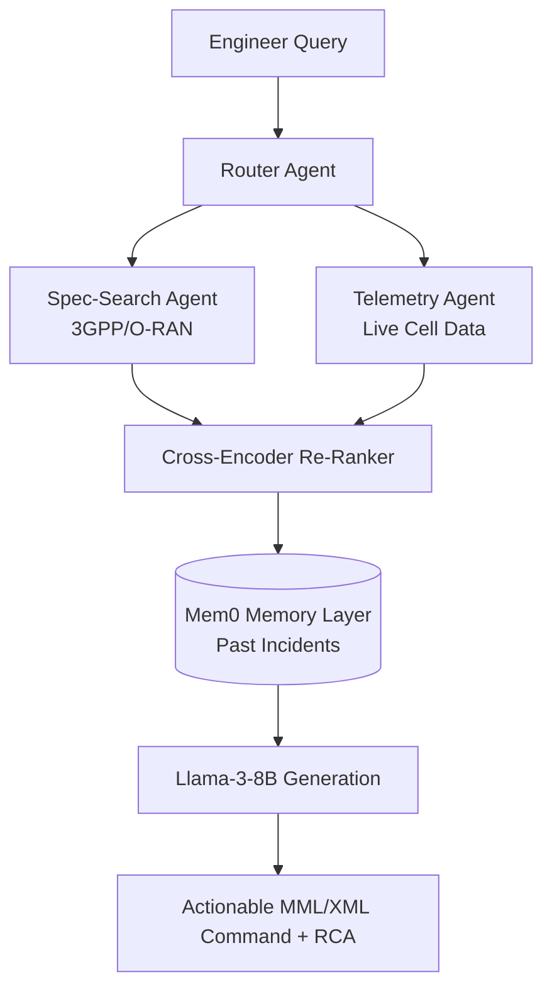

# 📡 RANSense-AI 

  <h3>RAG-Based Future-Ready Telecom RAN Assistant</h3>
  
<strong>Samsung ennovateX AX Hackathon 2026 — Problem 10</strong>

  
  
  

---

## 📖 Overview

**RANSense-AI** is a **Multi-Agent Memory-Augmented RAG Framework** tailored for future-ready Radio Access Networks (RAN). The exponential growth of 5G networks generates overwhelming volumes of telemetry. Correlating live fault alarms with dense, constantly updating 3GPP and O-RAN specifications is an arduous manual process. 

RANSense-AI transforms this passive infrastructure into a proactive, self-healing cognitive network by automating Root Cause Analysis (RCA) and providing immediate configuration adjustments.

---

## 🌟 Our 3 Unique Innovations

1. **Agentic Memory (Mem0):** Persistent recall of past cell outages accelerates RCA. No existing telecom RAG tool has this capability.
2. **Multi-Modal Tabular RAG (LlamaParse):** Correctly parses complex 3GPP specification tables that destroy standard PDF parsers, covering 3,000+ pages across TS 38.300, 38.401, 38.711, and more.
3. **Samsung CognitiV Integration:** Outputs actionable MML/XML config commands directly executable on Samsung vRAN nodes—delivering not just answers, but fixes.

---

## 📈 Quantified Impact

- **MTTR Reduction:** Decreased from ~4 hours (manual) to **<15 minutes (75% improvement)** via automated log-to-spec correlation.
- **RAG Context Precision:** Target **>85%** on the TeleQnA benchmark (vs. ~52% for a generic RAG baseline).
- **Knowledge Coverage:** 3,000+ pages of 3GPP specs and live PM/CM/FM telemetry streams ingested and queryable in real-time.

---

## 🆚 State of the Art (SOTA) Comparison

| System | Limitations vs. RANSense-AI |
| :--- | :--- |
| **TelcoBERT (Ericsson)** | Domain-tuned LLM, but lacks agentic memory and cannot ingest/act on live telemetry. |
| **Nokia AVA (Cognitive Analytics)** | Rule-based fault detection, no generative reasoning, no natural language interface. |
| **Generic LangChain RAG** | No telecom-specific parsing (destroys 3GPP tables), no persistent memory, no live telemetry correlation. |
| **RANSense-AI** | Multi-agent reasoning, tabular RAG, live telemetry, and Samsung vRAN actionable outputs. |

---

## 🏗 3-Layer Architecture 

RANSense-AI utilizes a robust 3-layer architecture coordinating a Multi-Agent Swarm via LangGraph:

1. **UI Layer:** Web Chat Interface + Dashboard for 1-click resolution.
2. **Backend Services:** API Gateway, LangGraph Router Agent (orchestrating Telemetry & Spec-Search Agents), and Llama-3 LLM Synthesis.
3. **Knowledge Base:** ChromaDB Vector Store with Hybrid Retrieval (Dense BAAI + Sparse BM25) and 3GPP/O-RAN docs.

*For an in-depth view of the architecture and data flows, see our [Architecture Documentation](docs/architecture.md).*

---

## 🛠 Technology Stack & AI Models

- **Foundation LLM:** `Meta-Llama-3-8B-Instruct` (HuggingFace). Inference is highly feasible on CPU-only vRAN edge nodes using GGUF quantization (Q4_K_M).
- **Fine-Tuning:** LoRA adaptation of Llama-3-8B on the TeleQnA dataset (QLoRA, 4-bit) for telecom domain accuracy.
- **Embedding & Reranking:** `BAAI/bge-large-en-v1.5` & `BAAI/bge-reranker-large` (Cross-encoder reranking mitigates hallucination risk).
- **Agent Orchestration:** LangGraph / AutoGen.
- **Memory Layer:** Mem0.
- **Document Parsing:** LlamaParse.
- **Evaluation:** RAGAS CI/CD pipeline for Context Precision & Answer Faithfulness.

---

## 📚 Detailed Technical Documentation

Explore our `docs/` folder for comprehensive system details:
- 🧠 [**Agent Logic (`docs/agents.md`)**](docs/agents.md): Standardised agent capability definitions and inter-agent communication contracts.
- 🏗 [**System Architecture (`docs/architecture.md`)**](docs/architecture.md): Full system design, constraints, and plausibility.
- 📊 [**Datasets (`docs/dataset.md`)**](docs/dataset.md): Details on 3GPP/O-RAN ingestion, TeleQnA, and the planned RAN-FaultSim synthetic dataset.
- 🧪 [**Evaluation Framework (`docs/evaluation.md`)**](docs/evaluation.md): RAGAS metrics, benchmarks, and results.

---

## 🚀 Development Roadmap

- Deploy an interactive multi-agent dashboard with a live telemetry query interface (FastAPI + React).
- Implement LlamaParse-based advanced chunking for structure preservation in 3GPP tables.
- Integrate the RAGAS CI/CD pipeline for automated evaluation on every commit.
- Deploy the GGUF quantized Llama-3-8B directly onto Samsung Networks COTS server infrastructure (CPU-only, no GPU dependency).

---

  
Built with ❤️ by <strong>Sarthak (Vellore Institute of Technology)</strong> for the Samsung ennovateX 2026 Hackathon

